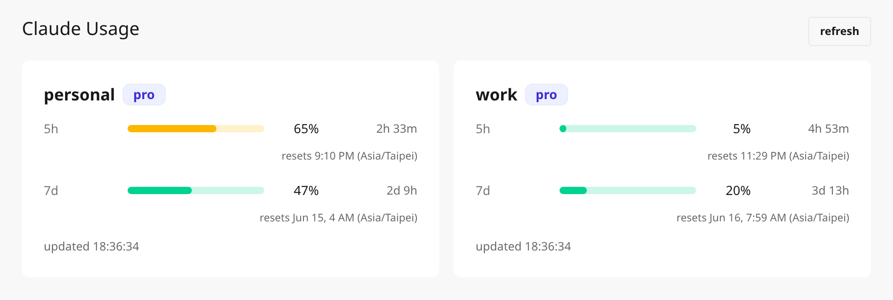
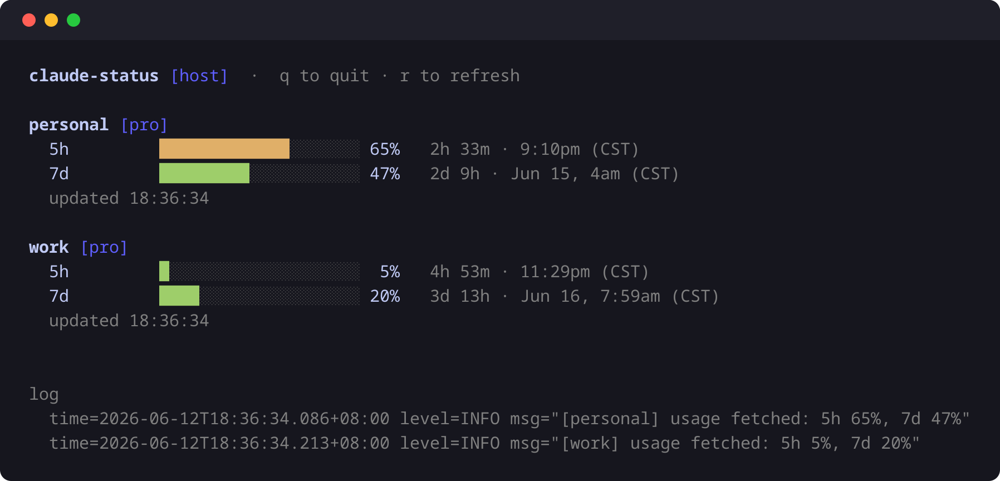

# claude-status

**See your Claude subscription usage at a glance — every account, in one place.**

When you log in to Claude Code with a subscription (OAuth), `/status` runs in an inference-only scope and **can't show your remaining usage or reset times** — you'd have to check them by hand on claude.ai → Settings → Usage, one account at a time. `claude-status` is a self-hosted dashboard that shows every account's live usage across all rate-limit windows, in the browser or the terminal.

[中文說明](README_tw.md)

## Screenshots

**Web dashboard** — every account, every rate-limit window, live over WebSocket:



**Terminal UI** — the same data in your terminal (`./claude-status tui`):



> The `personal` / `work` names are just labels you pick when logging in each account.

## Why this exists

I run several Claude subscriptions from one machine — a personal one and a work one — by minting a long-lived OAuth token per account and switching between them with shell aliases:

```sh
claude setup-token             # prints a long-lived OAuth token — run once per account
mkdir -p ~/.claude-tokens && chmod 700 ~/.claude-tokens
printf %s 'PASTE_PERSONAL_TOKEN' > ~/.claude-tokens/personal
printf %s 'PASTE_WORK_TOKEN'     > ~/.claude-tokens/work
chmod 600 ~/.claude-tokens/*

# pick which account each `claude` invocation uses
alias personal='CLAUDE_CODE_OAUTH_TOKEN="$(cat ~/.claude-tokens/personal)" claude'
alias work='CLAUDE_CODE_OAUTH_TOKEN="$(cat ~/.claude-tokens/work)" claude'
```

> **Gotcha:** if `~/.claude/.credentials.json` exists (left behind by an interactive `/login`), it can **override** `CLAUDE_CODE_OAUTH_TOKEN` and silently pin every alias to that one account — the opposite of the documented precedence. Fix: `mv ~/.claude/.credentials.json{,.bak}` and don't run `/login` in `~/.claude` again. *(Observed behavior; may change between Claude Code versions.)*

The catch: once you're logged in this way (subscription / OAuth), **`/status` runs in an inference-only scope and won't show your remaining usage or reset times.** The only built-in way to check is claude.ai → Settings → Usage — in the browser, one account at a time.

`claude-status` fixes that. It manages each account's credentials independently and shows them all on one dashboard:

- **One isolated OAuth grant per account** — no single-use-token collisions between accounts
- **Live usage** for every rate-limit window (5h / 7d / Opus / Sonnet)
- **Web dashboard + optional terminal UI**
- **Read-only, zero inference cost** — it calls the *same* `GET /api/oauth/usage` endpoint Claude Code uses to draw your limits. It never sends prompts, never spends quota, and keeps your tokens on `127.0.0.1` only.

> The aliases above are just how you switch accounts in the CLI. The dashboard gets its own credentials a different way — one throwaway `/login` per account (see step 1 below) — and each is a **separate** OAuth grant, so the two never interfere.

## Requirements

Just **[Docker](https://docs.docker.com/get-docker/)** — used once per account to generate credentials in a throwaway container. You don't need Go, Node, or any build tools (not even this repo): download a prebuilt binary from the [Releases](../../releases) page.

## 1 · Create an account credential

One command runs Claude Code's login inside a disposable [`node` container](https://hub.docker.com/_/node) (a Docker Official Image). Only the resulting `.credentials.json` is written to your machine — nothing else persists.

```sh
# Log in an account — name it whatever you like (e.g. "personal")
docker run -it --rm \
  -e CLAUDE_CONFIG_DIR=/data \
  -v "$PWD/accounts/personal:/data" \
  node:22-slim \
  sh -c "npm install -g @anthropic-ai/claude-code && claude /login"
```

An interactive Claude Code session opens — follow the prompts (pick a theme), then a login link appears: open it in your browser, authorize, and paste the code back. The credential lands at `accounts/personal/.credentials.json`. Repeat with a different name (`work`, `research`, …) for each extra account.

> **Linux:** the container runs as root, so the new files are root-owned — run `sudo chown -R "$USER" accounts/` afterward. (Not needed with Docker Desktop on macOS/Windows.)
> **Windows:** run the command in WSL or Git Bash (`$PWD` is Unix shell syntax).

## 2 · Download & run

1. Grab the binary for your OS from the [Releases](../../releases) page — e.g. `…-linux-amd64`, `…-windows-amd64.exe`, `…-darwin-arm64` (Apple Silicon) or `…-darwin-amd64` (Intel Mac).
2. Put it in the folder that contains your `accounts/` directory. On macOS/Linux make it executable: `chmod +x claude-status-*`.
3. Start it:

```sh
./claude-status serve        # headless web dashboard
```

Open **http://127.0.0.1:8787** in your browser.

Prefer a terminal UI? Run `./claude-status` (or `./claude-status tui`) instead — it shows the dashboard in your terminal *and* serves the web UI. Press `R` to refresh, `Q` to quit.

## Good to know

- **Keep credentials private & unique.** Each `accounts/<name>/.credentials.json` is single-use — don't copy it to another machine or run two instances on the same account, or the OAuth grant breaks (`invalid_grant`). Back up the `accounts/` folder to preserve your logins.
- **Localhost only.** The server binds to `127.0.0.1` by default and never sends tokens over the network. For remote access, tunnel over SSH/VPN rather than exposing the port.
- **Handy flags:** `--poll-interval 10m` (how often to fetch usage, min 3m), `--listen 127.0.0.1:9999` (change the port), `--accounts-dir <dir>`.
